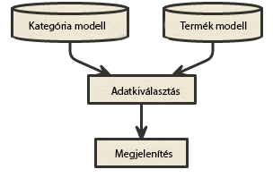
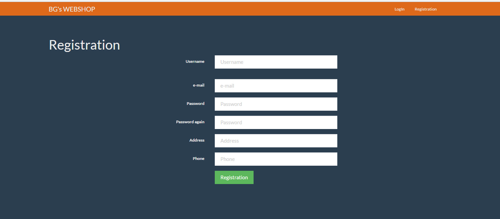
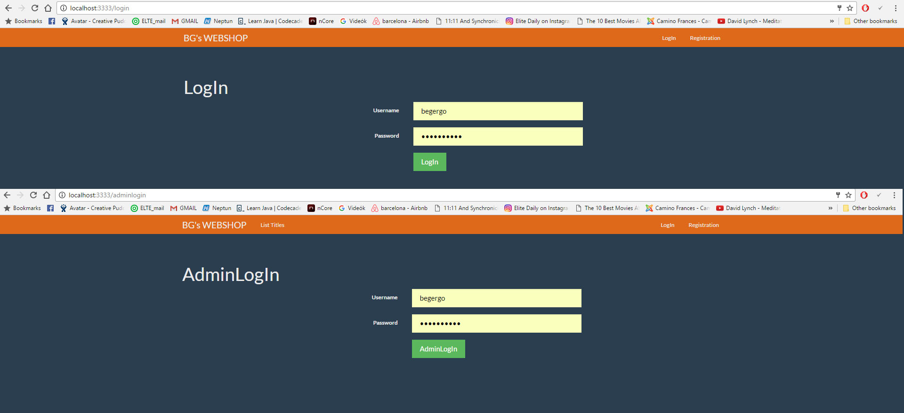
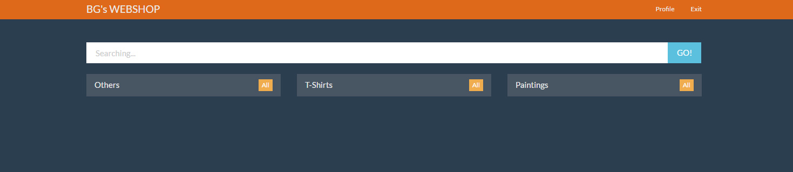
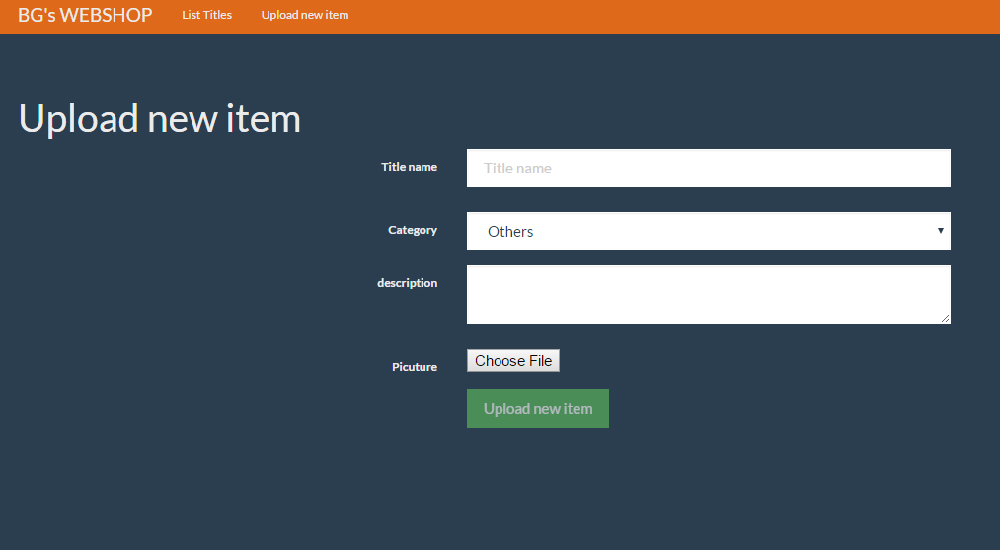
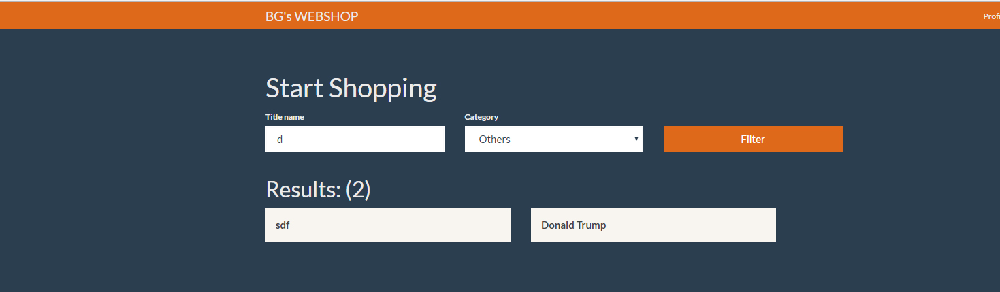
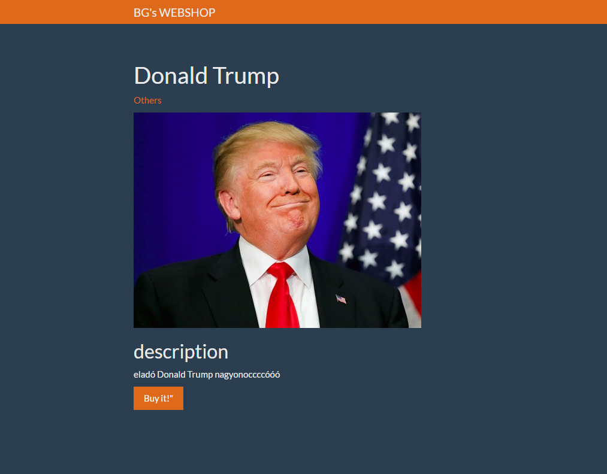
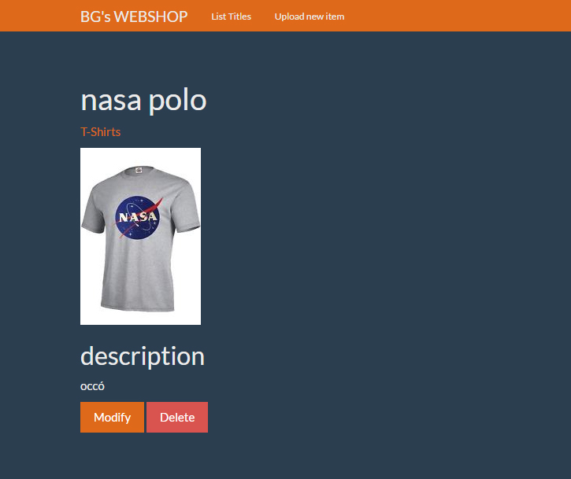

"# bead" 
# Dokumentáció
##1.beadando WEBSHOP
Alkalmazások fejlesztése 1 ELTE-IK Bencsik Gergo NYY8IY

###Követelményanalízis
#####1.1. Célkitűzés, projektindító dokumentum

A weboldal célja, hogy egy olyan opimalizalt web-shop platform jöjjön létre, ami nem egy adott témára,termékre specifikus,
hanem a későbbiekben is újrafelhasználható legyen. Az adminak, vagy a weboldal tulajdonosának lehetőságe legyen a 
termékekkel feltölteni az oldalt, ami megfelelő leírással szerepel a fogyasztók számára. Ezeket a föltötött termék
megjelenítesek később szerekszthetőek, karbantarhatóak. A vasárolni kívánt felhasználó számár a regisztráció biztosított 
az adatok biztoságának megörzése érdekében, majd a regisztrációt követően lehetőség van online vásárlásra (Banki terminál, PayPass)

######Funkcionális követelmények:

Regisztráció Bejelentkezés bejegyzések, termékek leírásának feltöltése,módosítása,
törlése 

Adminként szeretnék új termékekeket felöltetni 
Adminként szeretném a rendeléseket adatbázisban kezeleni

Vendégként a főoldalon szeretnék termékeket látni kategóriánként.
Vendégként szeretnék a termékek között szabadon böngészni.
Vendégként szeretnék egy termék megtekinteni.
Vendégként szeretnék termékek között keresni.
Vendégként szeretnék tudni regisztrálni az oldalra.

Felhasználóként szeretnék tudni bejelentkezni az oldalra.
Felhasználóként szeretném tudni a profiladataimat szerkeszteni.
Felhasználóként szeretnék vásárolni
Felhasználóként szeretném a vásárlásomat módosítani,törölni

######Nem funkcionális követelmények:

letiszutult design egyszerű,
de kényelemes felhasználó felület 
ergonomukis elrendezés egyértelmű,
átlátható struktúra

######1.2. Szakterületi fogalomjegyzék

**termék:**

A marketing szemlélet szerint olyan fizikai, esztétikai és szimbolikus tulajdonságok összessége,
amelyek valamilyen fogyasztói igény kielégítésére képesek. A termékhez kapcsolódnak kézzelfogható
tulajdonságok, de kapcsolódnak hozzá kézzel nem fogható tulajdonságok is, mint például a hozzá tartozó szervizlehetőség.

**Online vásárlás:**

Olyan vásárlás, amely az interneten keresztül valósul meg. Pl. egy webshop esetén, 
amikor is a vásárló egy webes felületen kiválaszt egy terméket, megrendeli, és a webáruház üzemeltetője házhoz szállítja azt.

**E-kereskedelem:**

Az E betű előtagként használva elektronikusan, azaz interneten keresztül megvalósítottat jelent. 
Így az E-kereskedelem az interneten megvalósított kereskedelmet jelent. A webáruházak üzemeltetői e-kereskedelmet folytatnak.

**Webáruház:**

A webshop szó „magyarítása”. Olyan „bolt” amely e-kereskedelemre alkalmas. 
A termékeket egy weboldalon lehet megnézni (leírások, fotók) és megrendelni, 
a termékek kiszállításáról pedig a webáruház üzemeltetője gondoskodik.
Létezik belőle olyan, amely egy offline bolthoz kapcsolódik, annak az internetes változata, 
és olyan is, ami mögött „csak” raktár vagy logisztikai központ áll.

#####1.3.	Használatieset-modell, funkcionális követelmények

**Vendég/Bejelentkezett Felhasználó**: Csak a publikus oldalakat éri el

*	Főoldal
*	Bejelentkezés/ Regisztráció
*   Meglévő termékek megtekintése
*   Keresés a termékek között

**Bejelentkezett admin**: Külön route elérése biztossított az adminak, ha /adminglogin oldalon jelentkezik
be az admin, (felhasznolonev:admin, jelszo: admin )akkor :

*	Új termék felvétele
*	Meglévő termék megtekintése
*	Meglévő termék
*	Meglévő termék

Vegyünk példának egy egyszerű folyamatot:

**Új termék felvétele:**

1.	Az admin az oldalra érkezve, bejelentkezik az /adminlogin felüleleten
2.	Bejelentkezés után megadhatja a termék nevét, kategóriáját, leírást, és feltölthet egy képet
3.  Az újtermék felvétele után módosíthatja a terméket a 'Modify'gombbal, és törölhet a 'Delete' gombbal

###2.	Tervezés

#####2.1.	Architektúra terv

######2.1.1. Komponensdiagram

######2.1.2. Oldaltérkép:

**Publikus:**
* Főoldal
* Bejelentkezés/Regisztráció

**Bejelentkezett felhasznaló:**
* Új termék felvétele

**Bejelentkezett felhasznaló:**
* Főoldal
* Termékek
  * Termékek megtekintése 
    * Keresés a termékek között

######2.1.3. Végpontok

* GET/: főoldal
* GET/resgister: regisztrációs oldal
* POST/register: regisztrációs oldalak felküldése
* GET/adminlogin: belejelentkező oldal
* POST/adminlogin: bejelentkező adatok  felküldése
* GET/login: belejelentkező oldal
* POST/login: bejelentkező adatok  felküldése
* GET/logout: kijelentkező oldal
* GET/profil : user/admin profil adatok
* POST/profile/edit: profil adat modosíto oldal
* POST/profile/edit_password: jelszó modosito oldal
* GET/tittle : termékek
* POST/tittle/create : új termék felöltő oldal /admin részére
* GET/tittle/:id : egyetlen termék megtekintése képpel
* GET/tittle/:id/edit : termék adatainak megváltoztatása
* POST/tittle/:id/edit : termék megváltozott adatainkak felküldése
* POST/tittle/:id/delete : termék törlése

#####2.2. Felhasználói-felület modell

######2.2.1.Oldalvázlatok:

**Regisztrálás**

**Bejelentkezés**

**Főoldal**

**Új termék**

**keresés**

**termék megtekintése**

**termék szekesztése/torles (kizarolag az admin felületen)**

###**3. Könyvtárstruktúrában lévő mappák funkciójának bemutatása**
+ app->Http : Ajax-os funkciókhoz szükséges kiegészítések
  * routes.js :  további szükséges végpontok felvétele
+ app->Http->Controllers
  * TitleController.js : 
    * ajaxDelete : a hirdetés Ajax-os törlését végzi
  * UserController.js : 
    * ajaxLogin : belépés Ajax-szal
+ public->scripts : a funkciókhoz szükséges kiegészítések
  * delete.js : Ajax-os törlés biztosítása
  * popup_login.js : bejelentkező felület pop-up ablakkal való megvalósítása
  * popup_login.js : regisztrációs felület pop-up ablakkal való megvalósítása

+ resources->views : kliensoldali funkciók működéséhez szükséges kiegészítések
Az alábbi fájlok módosításai a fenti scriptek importálásában változtak.
Ezen kívül az űrlapok küldés gombja le van tiltv addig, amíg a felhasználó ki nem töltötte az összes olyan mezőt, ami a fejlesztő által kötelezően kitöltendő kategóriában van meghatározva.
  * titles.njk 
  * admintitles.njk
  * master.njk
  * main.njk
  * login.njk

###**4. Tesztelés**

Maga a tesztelés az órán is használt Selinium IDE-val történt.
A teszteléshez tartozó mentett fájlok a *test* nevű mappában találhatók.
A tesztelés során az alapvető funkciók lettek ellenőrizve.

* Bejelentkezés : *login.html*
* Regisztráció : *registration.html*
* Új title hozzáadása : *newitem.html*
* Title módosítása: *modify.html*
* Titlte törlése : *delete.html*
* Kijelentkezés: *logout.html*

###**5. Felhasználó dokumentáció**

####**5.1. A futtatáshoz ajánlott hardver-, szoftver konfiguráció**
+ **Futtatáshoz szükséges operációs rendszer:** Tetszőlegesen bármilyen operációs rendszer használható
+ **A futtastáshoz szükséges hardver:** Az operációs rendszerek szerint van megadva
+ **Egyéb:** Internetes böngésző, JavaScript, illetve az alkalmazás által használt össze kiegészítőket tartalmazó fájlok telepítése ajánlott

####**5.2. Telepítés lépései: hogyan kerül a Githubról a célgépre a program, hogyan kell elindítani**
+ **1. lépés**
Egy konzol, azaz Parancssor nyitása a gépen
+ **2. lépés**
*git clone https://github.com/bengergo/bead/.git* parancs kiadása
+ **3. lépés**
*git config --global url."https://".insteadOf git://* parancs kiadása
+ **4. lépés**
*npm install* parancs kiadása
+ **5. lépés**
.env.example fájl átnevezése .env-re
+ **6. lépés**
*npm run dev* parancs kiadása
+ **7. lépés**
Böngészőben *localhost:3333* megnyitása

